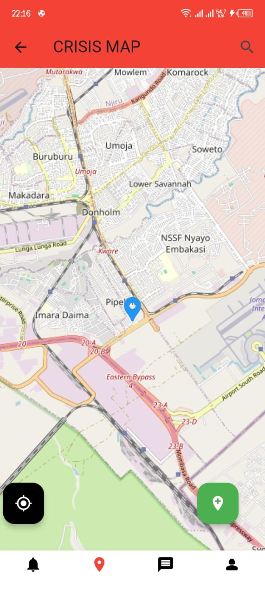

Here's the updated README file with the requested changes:

# Crisis Management App

**Description:**
A mobile app for reporting emergencies and incidents, providing location-based reporting, user interaction, and community engagement.

---

## Table of Contents:
1. [Features](#features)
2. [Installation](#installation)
3. [Usage](#usage)
4. [Screenshots & Videos](#screenshots-videos)
5. [License](#license)

---

## Features <a name="features"></a>
- Crisis reporting with geolocation.
- Upload images/videos for incident reports.
- Comment and engage with other users' reports.
- View and track the status of reported incidents (Resolved, In Progress, Pending).
- User messaging and profile views.

---

## Installation <a name="installation"></a>

### Prerequisites:
- Flutter SDK
- Android Studio / Xcode
- Firebase setup for Android and iOS

### Steps:

1. **Clone the repository:**
    
    ```bash
    git clone https://github.com/your-username/crisis-management-app.git
    ```

2. **Navigate to the project directory:**
    
    ```bash
    cd crisis-management-app
    ```

3. **Install dependencies:**
    
    ```bash
    flutter pub get
    ```

4. **Configure Firebase:**
    Follow the steps in [Firebase setup guide](https://firebase.google.com/docs/flutter/setup) to add Firebase to your project for both Android and iOS.

5. **Run the app:**
    
    ```bash
    flutter run
    ```

---

## Usage <a name="usage"></a>

### Landing Page
- **Description:** Users land on this page, which provides an overview and access to login or sign-up.

### Step 1: Sign Up / Login
- **Description:** Users can create a new account or log in if they already have an account.

  

### Step 2: Home Dashboard
- **Description:** Access the dashboard, view recent reports, and get quick access to reporting and messaging features.

  

### Step 3: Adding a New Report
- **Description:** Report an emergency by capturing or uploading a video/image, adding a description, and specifying the type of crisis.

  **Video Walkthrough:**
  
  

### Step 4: Viewing a Report
- **Description:** View detailed information about a reported incident, including the description, media, location, and status.

  

### Step 5: Adding a Message
- **Description:** Send a message to the report owner or comment on the report.

  

### Step 6: Viewing All Chats
- **Description:** Access the list of all conversations with other users, whether about reports or private messaging.

  

### Step 7: Viewing User Profile
- **Description:** View and edit your profile or another user's profile, including the list of reports and messages sent.

  

---

## Screenshots & Videos <a name="screenshots-videos"></a>

Here are some of the key features demonstrated through images and videos:

- **Home Screen:**  
  

- **Incident Reporting in Action:**  
  

---


## License <a name="license"></a>
Distributed under the MIT License. See LICENSE for more information.

---

This README is now streamlined and focused on the features you requested!
